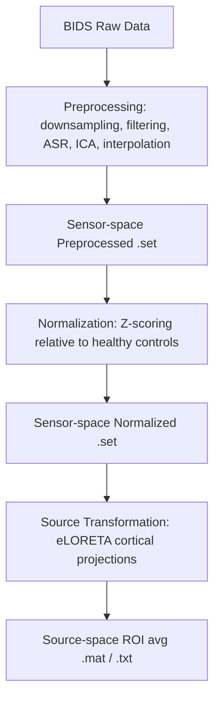

# EEG Preprocessing Stage Documentation (Phases 1-3)

This directory is dedicated to the sensor-space preprocessing, patient-control normalization, and source-space average ROI projection of the EEG signals (Stages 1-3).

---

## 📁 Stages & Outputs Overview

The preprocessing pipeline comprises the following processing stages and outputs:

### 1. Preprocessing (`Preprocessing`)
*   **Purpose**: Downsampling, filtering, artifact correction (ASR), independent component analysis (ICA), component rejection, and bad channel interpolation.
*   **Input Files**: BIDS-structured raw data.
*   **Output Files**: Preprocessed sensor-space `.set` (EEGLAB) and `.fdt` (binary data) files.
*   **Location**: `[database_root]/[country]/analysis_RS/Preprocessing/Step6_BadChanInterpolation/[subject]/eeg/*.set`

### 2. Normalization (`Normalization`)
*   **Purpose**: Normalizes the sensor power spectra of patients relative to a reference healthy control group.
*   **Input Files**: Preprocessed `.set` files from Step 6.
*   **Output Files**: Normalized sensor-space `.set` and `.fdt` files.
*   **Location**: `[database_root]/[country]/analysis_RS/Normalization/Step2_PatientControlNorm/[subject]/eeg/*.set`

### 3. Sourceavg ROI Transformation (`SourceTransformation` & `SourceNoNormalizedTransformation`)
*   **Purpose**: Projects sensor-space signals onto a cortical head model to extract source-space signals mapped to 81 cortical Regions of Interest (ROIs).
*   **Input Files**: Cleaned/normalized sensor-space `.set` files.
*   **Output Files**: 
    *   **Normalized Source (`SourceTransformation`)**: `.mat` files containing an `EEG_like` structure with a `data` field (matrix size: `81 ROIs × timepoints`). Location: `[database_root]/[country]/analysis_RS/SourceTransformation/Step2_SourceAvgROI/[subject]/eeg/*.mat`
    *   **Unnormalized Source (`SourceNoNormalizedTransformation`)**: `.txt` files containing the ROI timeseries matrix. Location: `[database_root]/[country]/analysis_RS/SourceNoNormalizedTransformation/*[subject]*Rois.txt`

---

## 🔄 Execution Workflow

The overall processing flow is as follows:



---

## 🚀 How to Run Preprocessing in MATLAB

All stages of preprocessing, normalization, and source projection are orchestrated through MATLAB:

### Step 1: Open MATLAB and Include Paths
1. Start MATLAB.
2. Add this directory and all its subfolders to the MATLAB path:
   ```matlab
   addpath(genpath('path/to/Pipeline/preprocessing'))
   ```

### Step 2: Configure Dependencies
Make sure you have **EEGLAB** and **FieldTrip** installed. Configure their paths at the very top of `runMainPipeline_.m`:
```matlab
% Set your local paths for EEGLAB and FieldTrip here if they are not in your MATLAB path
eeglab_path = 'C:/path/to/eeglab/eeglab.m';
fieldtrip_path = 'C:/path/to/fieldtrip/ft_defaults.m';
```
*(If they are already permanently added to your MATLAB path, you can leave these variables empty).*

### Step 3: Configure and Run the Orchestrator
1. Open [runMainPipeline_.m](runMainPipeline_.m).
2. The script is configured to use a **relative path** to locate the BIDS database automatically (`../../4ta_fase/Data_prueba/entrada`). This ensures the pipeline is fully reproducible on any PC without modifying hardcoded absolute paths (like `C:/Users/...`).
3. Set the step arguments in `f_mainPipeline` to control which stages execute:
   *   To run **Preprocessing** (Stages 1-2): Set `'runPrepro', true` and `'runPatientControlNorm', true`.
   *   To run **Source Transformation** (Stage 3): Set `'runChansToSource', true` and `'runSourceAvgROI', true`.
4. Execute `runMainPipeline_.m` in MATLAB.
