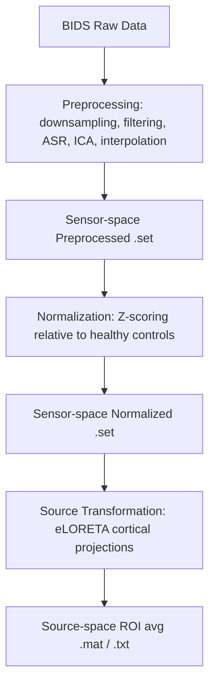

# EEG Preprocessing Stage Documentation (Phases 1-3)

This directory is dedicated to the sensor-space preprocessing, patient-control normalization, and source-space average ROI projection of the EEG signals (Stages 1-3).

---

## 📁 Stages & Outputs Overview

The preprocessing pipeline comprises the following processing stages and outputs:

### 1. Preprocessing (`Preprocessing`)
*   **Purpose**: Downsampling, filtering, artifact correction (ASR), independent component analysis (ICA), component rejection, and bad channel interpolation.
*   **Input Files**: BIDS-structured raw data.
*   **Output Files**: Preprocessed sensor-space `.set` (EEGLAB) and `.fdt` (binary data) files.
*   **Location**: `[database_root]/pipeline-metrics/preprocessing/salida/Preprocessing/Step6_BadChanInterpolation/[subject]/eeg/*.set`

### 2. Normalization (`Normalization`)
*   **Purpose**: Normalizes the sensor power spectra of patients relative to a reference healthy control group.
*   **Input Files**: Preprocessed `.set` files from Step 6.
*   **Output Files**: Normalized sensor-space `.set` and `.fdt` files.
*   **Location**: `[database_root]/pipeline-metrics/preprocessing/salida/Normalization/Step2_PatientControlNorm/[subject]/eeg/*.set`

### 3. Sourceavg ROI Transformation (`SourceTransformation` & `SourceNoNormalizedTransformation`)
*   **Purpose**: Projects sensor-space signals onto a cortical head model to extract source-space signals mapped to 81 cortical Regions of Interest (ROIs).
*   **Input Files**: Cleaned/normalized sensor-space `.set` files.
*   **Output Files**: 
    *   **Normalized Source (`SourceTransformation`)**: `.mat` files containing an `EEG_like` structure with a `data` field (matrix size: `81 ROIs × timepoints`). Location: `salida/SourceTransformation/Step2_SourceAvgROI/[subject]/eeg/*.mat`
    *   **Unnormalized Source (`SourceNoNormalizedTransformation`)**: `.txt` files containing the ROI timeseries matrix. Location: `salida/SourceNoNormalizedTransformation/*[subject]*Rois.txt`

---

## 🔄 Execution Workflow

The overall processing flow is as follows:



---

## 🚀 How to Run Preprocessing in MATLAB

All stages of preprocessing, normalization, and source projection are orchestrated through MATLAB:

### Step 1: Install Dependencies
To run the preprocessing pipeline, a third-party user **MUST** install the following MATLAB Toolboxes/Plugins:
1. **EEGLAB**: The core framework for EEG processing.
2. **FieldTrip**: Used for specific spatial and source-level functions.
3. **EEGLAB Plugins**: `clean_rawdata`, `ICLabel`, `dipfit`, `firfilt`, `bva-io`. (EEGLAB will usually attempt to auto-install these if missing).
4. **MATLAB Toolboxes** (Optional but recommended): *Wavelet Toolbox* (used by eyeCatch; if missing, the pipeline gracefully falls back to ICLabel).

### Step 2: Configure Paths
1. Start MATLAB.
2. Open `runMainPipeline_.m`. At the top of the file, you must specify the absolute paths to your local EEGLAB and FieldTrip installations. For example:
   ```matlab
   eeglab_path = 'C:/Users/your_user/AppData/Roaming/MathWorks/MATLAB Add-Ons/Collections/EEGLAB/eeglab.m';
   fieldtrip_path = 'C:/Users/your_user/AppData/Roaming/MathWorks/MATLAB Add-Ons/Collections/FieldTrip/ft_defaults.m';
   ```
   *(If you installed them via MATLAB Add-Ons on Windows, they are typically located in `%APPDATA%\MathWorks\MATLAB Add-Ons\Collections\`)*.

### Step 3: Configure and Run the Orchestrator
1. Open [runMainPipeline_.m](runMainPipeline_.m).
2. The script is configured to use a **relative path** to locate the BIDS database automatically (`databasePath`). By default, it points to `../../2_prepro_analysis_brainlat`. Update this variable if your raw data folder has a different name or location.
3. The output will automatically be saved into a new folder called **`salida/`** directly inside this `preprocessing/` directory.
4. Execute `runMainPipeline_.m` in MATLAB.
